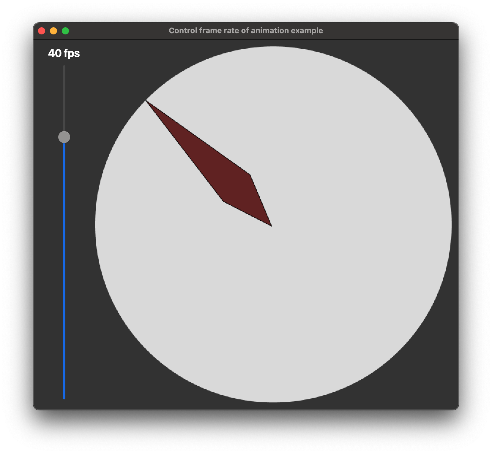

# Animation Control with PyQt6 

## Introduction

This PyQt6 widget is a subclass of `QLabel` and provides
a way to control animation through a set of images loaded from a 
directory. 

The provided images are of a simple vector graphic rotated through 360 degrees,
and while it would be more efficient to animate the rotation of one image, 
this widget is for more complex cycle of frames. For example, to simulate animation
through frames of a pre-rendered 3D scene.



## Installation

1. Clone the repository
```commandline
$ git clone git@github.com:gmarzloff/animation-widget.git
$ cd animation-widget
```

2. create a virtual environment and load it:
```commandline
$ python3 -m venv venv
$ ./venv/Scripts/activate
```

3. install the packages in the `requirements.txt` file.
```commandline
$ pip install -r requirements.txt
```

4. run the main.py file either in PyCharm IDE or directly from the command line: 
```commandline
$ python main.py
```

## Usage
Instantiate the widget where you build the GUI, passing the `Path` of the image directory.
The widget sorts the files in the directory alphabetically and places them in that
order for the animation.

```python
parent_path = Path(__file__).parent
images_path = parent_path / 'images/animation_set/'
self.animation_widget = AnimationWidget(images_path)
```

call `AnimationWidget.advance()` on a `Timer` to move through the animation frames.

```python

    def __init__(self):
        super().__init__()
        # ...
        self.refresh_interval = int(1000/frames_per_second)
        self.timer = QTimer()
        self.timer.timeout.connect(self.animation_handler)
        self.timer.start(self.refresh_interval)
```

```python
    def animation_handler(self):
        self.animation_widget.advance()
        self.timer.start(self.refresh_interval)

```
## Demo

```commandline
$ python main.py
```

Drag the slider to change the animation's frame rate in real time. 